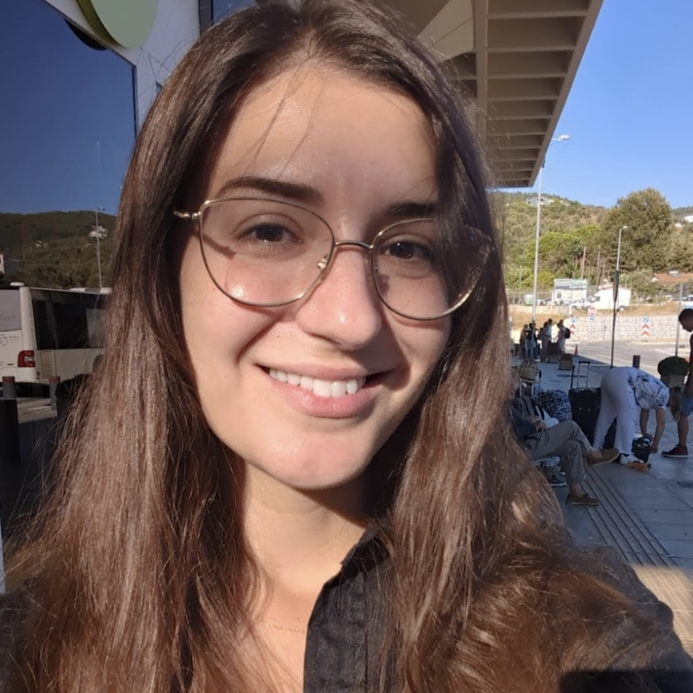

    

    I am an evolutionary geneticist at the Department of Biological Sciences at the University at Buffalo, SUNY, working with <a href="https://gokcumenlab.org/">Omer Gokcumen</a>. I earned my PhD in Evolutionary Genetics from the Autonomous University of Barcelona, where my research focused on inversion polymorphisms in <em>Drosophila subobscura</em>.

    My <a href="https://biolevol.github.io/projects/">research</a> explores the mechanistic basis of structural variation and its role in shaping genome evolution. I study how structural variants arise, persist, or are lost in populations, and how they influence adaptation across different environments and timescales. Above all, I love all things recombination.

    

